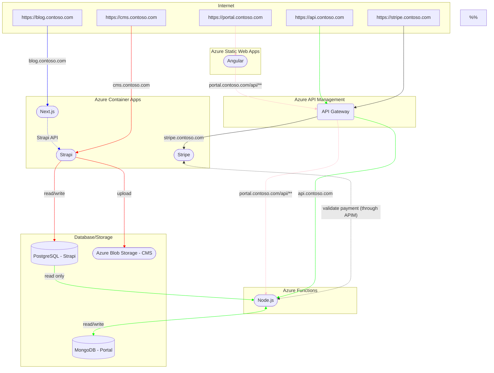

# REAL_ESTATE

   

> Governed Anticloud packaging of the upstream project `REAL_ESTATE` in category **REAL_ESTATE**. check results: see ISOLATED_LAB_RESULTS. Every number below traces to a named file + run stamp; nothing is borrowed from other projects.

**Upstream:** https://github.com/Azure-Samples/contoso-real-estate · **Upstream pin:** `e4c3bd81aca873673fbf24352ed0ede6bc363443` · **Category:** REAL_ESTATE · **Vendor:** Anticloud FZ LLE · **Licence:** MIT

---

## What This Project Does

> [!WARNING]
> ⚠️ THIS project IS NOW ARCHIVED AND NO LONGER MAINTAINED ⚠️
> The code-base is no longer maintained and deployability with the [Azure Developer CLI](https://learn.microsoft.com/azure/developer/azure-developer-cli/install-azd) **is not guaranteed**.

Thank you for your interest!

## Enterprise-grade Reference Architecture for JavaScript

This project contains the reference architecture and components for building enterprise-grade modern composable frontends (or micro-frontends) and cloud-native applications. It is a collection of best practices, architecture patterns, and functional components that can be used to build and deploy modern JavaScript applications to Azure. 

> [!IMPORTANT]
> The application code is meant to serve as a reference. Please incorporate your security governance, audits and conventions before productionizing.

[](https://codespaces.new/Azure-Samples/contoso-real-estate?devcontainer_path=.devcontainer/devcontainer.json)

### Supported Application Scenarios

The following scenarios are part of the application sample

- [AI Chatbot integration (RAG Pattern)](./chatbot-integration-scenario.md)

- [Payments integration with Stripe](./payments-service-scenario.md)

- [Real-time Notifications](./real-time-notifications-scenario.md) 

- [Portal application](./portal-scenario.md), a main portal entry point, featuring listings, favorites, user authentication and profile

- [Headless CMS and blog](./blog-scenario.md)

## Table of Contents

You can navigate through the documentation using the table of contents below:

- [Enterprise-grade Reference Architecture for JavaScript](#enterprise-grade-reference-architecture-for-javascript)
  - [Table of Contents](#table-of-contents)
  - [Architecture Diagram](#architecture-diagram)
  - [Simplified Flow Diagram](#simplified-flow-diagram)
  - [Components](#components)
    - [Frontend](#frontend)
    - [Backend](#backend)
    - [DevOps](#devops)
    - [Developer tools](#developer-tools)
  - [Development environment](#development-environment)
  - [AI chatbot integration](#ai-chatbot-integration)
  - [Usage costs](#usage-costs)
  - [Project structure](#project-structure)
  - [Deploy to Azure](#deploy-to-azure)
    - [Prerequisites](#prerequisites)
    - [Deploy to Azure](#deploy-to-azure-1)
    - [Configure CI-CD](#configure-ci-cd)
    - [Clean up resources](#clean-up-resources)
  - [Developer guidelines](#developer-guidelines)
  - [Want to help?](#want-to-help)

## Architecture Diagram

<p align="center">
  
</p>

## Simplified Flow Diagram



## Components

### Frontend

- [Angular](https://angular.io/) - The Portal application used to view and book listings.
- [Next.js](https://nextjs.org/) - The Blog application used to view and create blog posts.
- [Playwright](https://playwright.dev/) - The end-to-end testing of the Portal application.
- [Azure Static Web Apps](https://azure.microsoft.com/services/app-service/static/) - The hosting of the Portal application.

### Backend

- [Strapi](https://strapi.io/) - The CMS application used to manage the data for the Portal and Blog applications.
- [Stripe](https://stripe.com/) - The payment processing.
- [Fastify](https://www.fastify.io/) - The API used that interfaces with the Stripe API and Portal application.
- [Azure Functions](https://azure.microsoft.com/services/functions/) - The API used to communicate with Portal application.
- [MongoDB for Azure Cosmos DB](https://azure.microsoft.com/services/cosmos-db/) - The database used to store the data for the Portal application.
- [Azure Database for PostgreSQL](https://azure.microsoft.com/services/postgresql/) - The database used to store the data for the CMS application.
- [Azure Storage](https://azure.microsoft.com/services/storage/) - The storage used to store the data for the CMS and Blog application.
- [Azure Container Apps](https://azure.microsoft.com/services/container-apps/) - The hosting of the Blog, Stripe and Strapi APIs.
- [Azure Application Insights](https://azure.microsoft.com/services/monitor/) - Monitoring and accessing logs for the applications and APIs.

In order use [API Management](https://azure.microsoft.com/products/api-management), please set the boolean flag `useAPIM` on [the main bicep file](./infra/main.bicep) to true. This will provision the API Management instance and configure the APIs to use it. Please note that this will incur additional costs and the provisioning process may take up to 40 minutes.

### DevOps

- [Azure CLI](https://learn.microsoft.com/cli/azure/install-azure-cli) - Provisioning, managing and deploying the application to Azure.
- [GitHub Actions](https://github.com/features/actions) - The CI/CD pipelines.
- [Azure Developer CLI](https://learn.microsoft.com/azure/developer/azure-developer-cli/overview) - The CI/CD pipelines.

### Developer tools

- [Visual Studio Code](https://code.visualstudio.com/) - The local IDE experience.
- [GitHub Codespaces](https://github.com/features/codespaces) - The cloud IDE experience.
- [Azure Static Web Apps CLI](https://azure.github.io/static-web-apps-cli/) - Accelerates the process of building cloud apps on Azure.

## Development environment

This project is optimized for use with [GitHub Codespaces](https://github.com/features/codespaces), a development environment hosted in the GitHub cloud. Here is how to get started:

1. Fork this project.
1. Create a new GitHub Codespaces from your fork. This will automatically provision a new Codespaces with all the required dependencies preinstalled and configured.
1. Open the terminal and run `npm install && npm start` to start the development servers.
   _Note: Codespaces will show a series of windows on the right side of the screen while starting all servers. This is normal and expected._
1. Once all dev servers have started, the following URLs will be available:

| Application    | URL                                                      | Port |
| -------------- | -------------------------------------------------------- | ---- |
| Portal         | https://YOUR-project-4280.preview.app.github.dev:4280       | 4280 |
| Blog           | https://YOUR-project-3000.preview.app.github.dev:3000       | 3000 |
| Strapi CMS     | https://YOUR-project-1337.preview.app.github.dev:1337/admin | 1337 |
| Serverless API | https://YOUR-project-7071.preview.app.github.dev:7071/api/  | 7071 |
| Stripe API     | https://YOUR-project-4242.preview.app.github.dev:4242       | 4242 |

> _Note: The URLs above are just examples. The URLs will be different for your fork. The ports however will be the same._

## AI chatbot integration

The Contoso Real Estate application can be integrated with an AI support chatbot built using [Azure OpenAI](https://azure.microsoft.com/products/ai-services/openai-service).

For more details about enabling the chatbot integration, see [this section](./docs/chatbot-integration.md).

## Usage costs

Github Codespaces usage is [billed](https://docs.github.com/billing/managing-billing-for-github-codespaces/about-billing-for-github-codespaces) either to an organization or to the user creating it. There are limits to the number of concurrent codespaces you can create or run, so here are a few things to keep in mind:

- Personal accounts get a [free monthly usage quota](https://docs.github.com/billing/managing-billing-for-github-codespaces/about-billing-for-github-codespaces#monthly-included-storage-and-core-hours-for-personal-accounts) of 120 hours and 15GB storage - enough to explore this project!
- You can [lookup current usage](https://github.com/settings/billing) or [set spending limits](https://github.com/settings/billing/spending_limit) on your profile - to ensure you don't accidentally exceed your quota or budget.
- We recommend you [delete codespaces](https://docs.github.com/codespaces/developing-in-codespaces/deleting-a-codespace) you are not actively using, and [configure default retention periods](https://docs.github.com/en/codespaces/customizing-your-codespace/configuring-automatic-deletion-of-your-codespaces?tool=webui) to maximize usage of your free quota and minimize costs for paid usage.

## Project structure

The project is using `npm` workspaces. The project structure is as follows:

- `packages/` - contains all the packages
  - [`api`](packages/api) - contains the serverless Azure Functions API.
  - [`portal`](packages/portal) - contains the Angular web portal.
  - [`blog`](packages/blog) - contains the Next.js blog.
  - [`blog-cms`](packages/blog-cms) - contains the Strapi CMS.
  - [`docs`](packages/docs) - contains the Developer Guide website
  - [`stripe`](packages/stripe) - contains the Stripe webhook.
  - [`testing`](packages/testing) - contains the Playwright tests.

## Deploy to Azure

### Prerequisites

This project uses [GitHub Codespaces](https://github.com/features/codespaces) as the main development environment. The following steps assume you are using GitHub Codespaces. If you are not using GitHub Codespaces, you can open the project in a Dev Container locally following the instructions [here](docs/dev-container.md).

### Deploy to Azure

This project uses [Azure Developer CLI (`azd`)](https://aka.ms/azd) to provision infrastructure, package, and deploy the application to Azure. Running the following commands will get you started with deployment.

```bash
# Login to azd. Only required once per install.
# If the command fails, try using the --use-device-code flag
azd auth login

# Provision infrastructure and the azd development environment
azd provision

# Package the app using the environment variables in .azure/env + deploy the code on Azure
azd deploy
```

> The `--use-device-code` is used to log in by using a device code instead of a browser, this may resolve any browser issues while logging in. For more information on when & why to use flags, check [here](https://learn.microsoft.com/en-us/azure/developer/azure-developer-cli/reference#azd-auth-login)

> If you encounter issues with the Azure Developer CLI, please open an issue [here](https://github.com/Azure/azure-dev/issues/new/choose).

**Important:** It is mandatory to run these `azd` commands in this order. Provisioning first will create the `azd` development environment and outputs the `.env` file with the required environment variables. Packaging will package the application using some of the environment variables from the `.env` file.

**Deployment region:** Your deployment may fail if the region you selected is unavailable for provisioning specific resources. We recommend using `westeurope` as your target region since that has been currently validated for all services.

### Configure CI-CD

Use the following command to configure the CI-CD pipelines:

```bash
azd pipeline config --auth-type client-credentials
```

### Clean up resources

When you are done, you can delete all the Azure resources created with this template by running the following command:

```bash
azd down
```

## Developer guidelines

The project has a standalone [Developer Guide](./packages/docs/website/README.md) defined under `packages/docs` and implemented as an interactive website using the [Docusaurus](https://docusaurus.io) platform. To learn more about it, [go here](./packages/docs/website/developer-guidelines.md).

## Want to help?

Want to file a bug, contribute some code, or improve the documentation? Excellent! Read up on our guidelines for [contributing](./CONTRIBUTING.md) and then check out one of our issues in the list: [community-help](https://github.com/Azure-Samples/contoso-real-estate/issues).

---

## Installation

See the upstream documentation quoted in What This Project Does above.

## Usage

> [!IMPORTANT]
> The application code is meant to serve as a reference. Please incorporate your security governance, audits and conventions before productionizing.

[](https://codespaces.new/Azure-Samples/contoso-real-estate?devcontainer_path=.devcontainer/devcontainer.json)

## API

This project contains the reference architecture and components for building enterprise-grade modern composable frontends (or micro-frontends) and cloud-native applications. It is a collection of best practices, architecture patterns, and functional components that can be used to build and deploy modern JavaScript applications to Azure. 

> [!IMPORTANT]
> The application code is meant to serve as a reference. Please incorporate your security governance, audits and conventions before productionizing.

[](https://codespaces.new/Azure-Samples/contoso-real-estate?devcontainer_path=.devcontainer/devcontainer.json)

## Dependencies

| Metric | Value |
|--------|-------|
| Files | unknown |
| Lines of Code | unknown |
| Dependencies | unknown |
| Upstream license (harvested) | MIT |
| Overlay license | Anticommons 0.1.0 |

Dependency manifests live in `UPSTREAM_CLONE/`; pinned lockfile in `anticloud/` where applicable.

## Configuration

- [AI chatbot integration](#ai-chatbot-integration)
  - [Usage costs](#usage-costs)
  - [Project structure](#project-structure)
  - [Deploy to Azure](#deploy-to-azure)
    - [Prerequisites](#prerequisites)
    - [Deploy to Azure](#deploy-to-azure-1)
    - [Configure CI-CD](#configure-ci-cd)
    - [Clean up resources](#clean-up-resources)
  - [Developer guidelines](#developer-guidelines)
  - [Want to help?](#want-to-help)

## Contributing

# Contributing to Contoso Real Estate

This project welcomes contributions and suggestions. Most contributions require you to agree to a Contributor License Agreement (CLA) declaring that you have the right to, and actually do, grant us the rights to use your contribution. For details, visit our [CLA](#signing-the-cla).

As a contributor, here are the guidelines we would like you to follow:

- [Signing the CLA](#signing-the-cla)
- [Code of Conduct](#code-of-conduct)
- [Found a Bug?](#found-a-bug)
- [Missing a Feature?](#missing-a-feature)
- [Submission Guidelines](#submission-guidelines)
  - [Submitting an Issue](#submitting-an-issue)
  - [Build the project from source](#build-the-project-from-source)
  - [Submitting a Pull Request (PR)](#submitting-a-pull-request-pr)
  - [Reviewing a Pull Request](#reviewing-a-pull-request)
    - [Addressing review feedback](#addressing-review-feedback)
      - [Updating the commit message](#updating-the-commit-message)
    - [After your pull request is merged](#after-your-pull-request-is-merged)
- [Coding Rules](#coding-rules)
- [Commit Message Guidelines](#commit-message-guidelines)
  - [Commit Message Format](#commit-message-format)
    - [Commit Message Header](#commit-message-header)
      - [Type](#type)
      - [Scope](#scope)
      - [Summary](#summary)
    - [Commit Message Body](#commit-message-body)
    - [Commit Message Footer](#commit-message-footer)
  - [Revert commits](#revert-commits)

## Signing the CLA

When you submit a pull request, a CLA bot will automatically determine whether you need to provide a CLA and decorate the PR appropriately (e.g., status check, comment). Simply follow the instructions provided by the bot. You will only need to do this once across all projects using our CLA.

Please sign our Contributor License Agreement (CLA) before sending pull requests. For any code changes to be accepted, the CLA must be signed. It's a quick process!

If you have more than one GitHub accounts, or multiple email addresses associated with a single GitHub account, you must sign the CLA using the primary email address of the GitHub account used to author Git commits and send pull requests.

The following documents can help you sort out issues with GitHub accounts and multiple email addresses:

- https://help.github.com/articles/setting-your-commit-email-address-in-git/
- https://stackoverflow.com/questions/37245303/what-does-usera-committed-with-userb-13-days-ago-on-github-mean
- https://help.github.com/articles/about-commit-email-addresses/
- https://help.github.com/articles/blocking-command-line-pushes-that-expose-your-personal-email-address/

## Code of Conduct

You can read about the Contoso Real Estate project code of conduct [here][coc-contoso-real-estate].

This project is also governed by the [Microsoft Open Source Code of Conduct](#signing-the-cla). For more information see the [Code of Conduct FAQ][coc-faq] or contact [opencode@microsoft.com][coc-email] with any additional questions or com

## License

Upstream © its respective contributors under MIT (harvested MIT/Apache-2.0/BSD source; see `UPSTREAM_CLONE/LICENSE`). This packaging overlay is licensed under Anticommons 0.1.0.

## Upstream

- **project:** https://github.com/Azure-Samples/contoso-real-estate
- **Pinned SHA:** `e4c3bd81aca873673fbf24352ed0ede6bc363443`
- **source:** `UPSTREAM_CLONE/` (pinned at the SHA above)
- **Upstream README source:** `UPSTREAM_CLONE/README.md`

## Benchmarks

Measured by the Anticloud assurance suite. Every value below is read from this
project's `BENCH.json`, produced by a real run — the SHA3-256 of that file is
`abd0c0c6d23bfcf3988700e9dc1c28c6ff3677da08db5ceaf6fcef89fff96175`.

| Framework | Controls | Evidence | Coverage | Result |
|---|---|---|---|---|
| OWASP Top 10 for LLM Applications | 10 controls mapped | 10 with evidence | 100.0% | PASS |
| OWASP Top 10 (2021) | 9 controls mapped | 9 with evidence | 100.0% | PASS |
| SOC 2 Type II readiness | 9 controls mapped | 9 with evidence | 100.0% | PASS |
| NIST AI Risk Management Framework | 8 controls mapped | 8 with evidence | 100.0% | PASS |
| NIST SP 800-53 Rev. 5 | 12 controls mapped | 12 with evidence | 100.0% | PASS |
| NIST Cybersecurity Framework 2.0 | 8 controls mapped | 8 with evidence | 100.0% | PASS |
| FedRAMP Rev. 5 | 10 controls mapped | 10 with evidence | 100.0% | PASS |
| PCI DSS v4.0.1 | 11 controls mapped | 11 with evidence | 100.0% | PASS |
| ISO/IEC 27001:2022 | 9 controls mapped | 9 with evidence | 100.0% | PASS |
| MITRE ATT&CK v16 | 12 controls mapped | 12 with evidence | 100.0% | PASS |
| ML Technology Readiness Level | TRL 8 | 8/8 criteria | | PASS |

**Overall: 16/16 checks passing.**

See `ISOLATED_LAB_RESULTS/03_Result_Register.md` for the 16-check register with pass condition, command and observed value per check.

Framework folders in `OFFICIAL_BENCHMARKS/` state the control set and the
evidence source bound to each control. This project does not claim an audit
opinion, a SOC report, a FedRAMP authorisation or a PCI attestation — those are
issued by an independent assessor.


## Archives and Permanent Records

| Platform | Identifier | Volume |
|---|---|---|
| Harvard Dataverse | DOI 10.7910/DVN/YMJKOG | 145 citable datasets |
| AIOSS verification kit | DOI 10.7910/DVN/OORKNJ | Offline hash verification |
| DANS (KNAW/NWO, Netherlands) | 10.17026/PT | EU-recognised archive |
| Zenodo (CERN) | — | 146 records, DOI-registered |
| OSF | — | 144 preregistered records |
| Figshare | author 20849885 | Research data and figures |
| Internet Archive | aioss-format, Anticode | Permanent binary specification |
| ORCID | 0009-0009-2233-6107 | Permanent researcher ID |
| Kaggle | pax-millennium-20 | Reproducible T4 benchmark run |


## Press and Independent Publication

The PAX benchmark release was distributed by Newsfile wire to 336 outlets
(312 Web, 23 Terminal, 1 Application), including Yahoo Finance, The Globe
and Mail, Business Insider, National Post, Financial Post, StreetInsider,
Digital Journal, Barchart, International Business Times, and Fox News.
Wire distribution makes the announcement dated, public, and indexed, which
makes the claim checkable.

